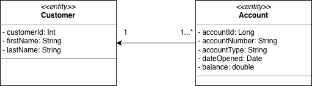
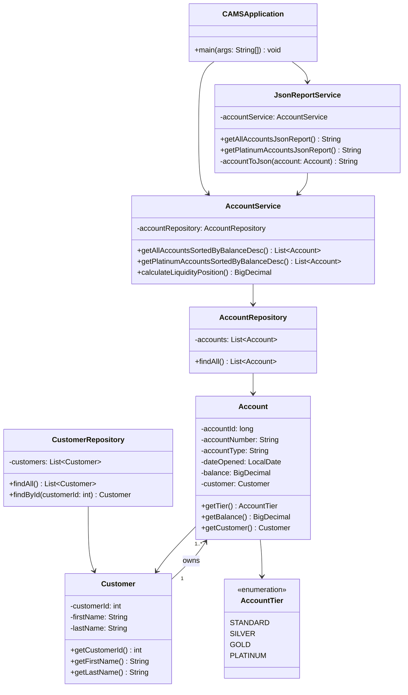

# CAMS

Customer Accounts Management System, a Java console application for viewing account reports.

## Requirements

- Java 25
- Maven

## Build and Run

```bash
mvn clean package
java -jar target/pamsapp.jar
```

## Class Diagram



## Detailed Design Diagram




## GitHub Repository

[https://github.com/Darkhaamn/miu-cs425-quiz1](https://github.com/Darkhaamn/miu-cs425-quiz1)

## Developed By

Darkhanbayar